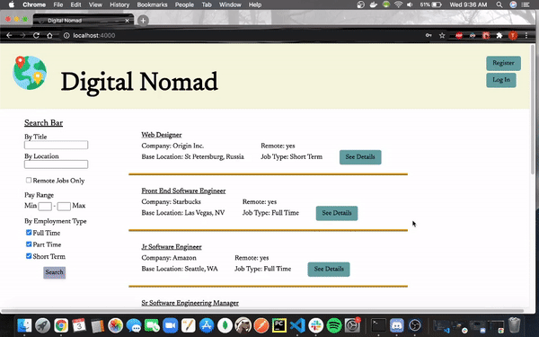

# Digital Nomad

        

A single-page web application for both individuals and companies. Users can search for jobs and also post a schedule that they plan to work for a certain amount of time. Companies can post jobs and also view their employees and the schedules/locations that all of their remote employees are working in.

## Getting Started

### Installation

Clone the repo
<pre>git clone https://github.com/TanisTanis/digitalnomad.git</pr>
  
